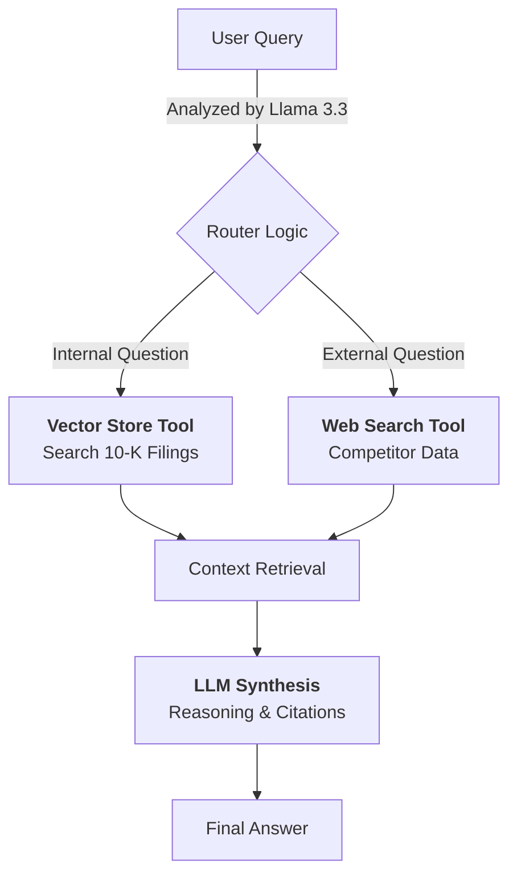

# Agentic Financial Analyst (SEC 10-K)

An autonomous AI agent designed to audit public company Annual Reports (SEC 10-K Filings), extract critical risk factors, and benchmark financial performance against real-time market data.

The system utilizes a **Router-based RAG (Retrieval Augmented Generation)** architecture powered by **Llama 3.3 (70B)** to verify internal claims against external competitors.

---

## 🏗 System Architecture

The agent operates on a dynamic routing logic, deciding autonomously whether to trust internal documents or verify facts with the live web.


## The "Twin-Engine" Approach

Internal Engine (RAG): Used for questions like "What are the primary supply chain risks?" or "Summarize the revenue recognition policy." It retrieves exact page numbers from the PDF.

External Engine (Web): Used for questions like "How does Tesla's growth compare to BYD in 2024?" It fetches real-time data that isn't in the historical 10-K.

## ⚙️ Data Ingestion Pipeline
Before the agent runs, raw PDF financial reports are processed into a semantic search index.

```
graph LR
    A[Raw PDF 10-Ks] --> B[PyPDFLoader]
    B --> C[Text Splitting<br/>(1000 token chunks)]
    C --> D[HuggingFace Embeddings<br/>(all-MiniLM-L6-v2)]
    D --> E[(ChromaDB<br/>Vector Store)]
```

## Technical Components

* Loader: PyPDFLoader handles complex PDF parsing.
* Chunking: RecursiveCharacterTextSplitter preserves the context of long financial tables.
* Embeddings: Local HuggingFaceEmbeddings ensure fast, cost-free vectorization without API rate limits.
* Vector Store: ChromaDB persists the data locally for low-latency retrieval.

🚀 Setup & Usage

Prerequisites

* Python 3.10+
* API Keys for Groq (LLM) and Tavily (Web Search)

Installation

Clone the repository:

