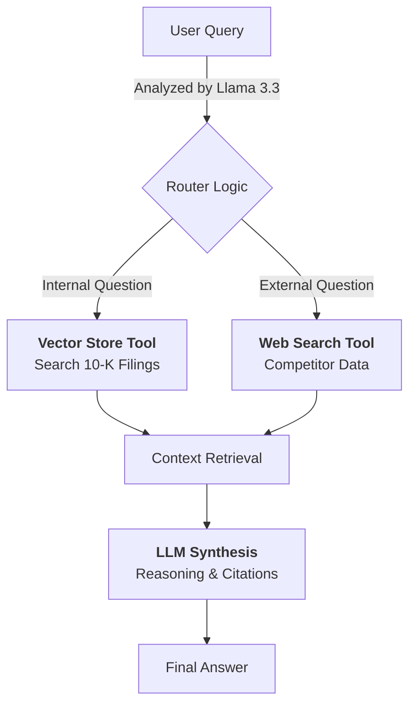

# Agentic Financial Analyst (SEC 10-K)

An autonomous AI agent designed to audit public company Annual Reports (SEC 10-K Filings), extract critical risk factors, and benchmark financial performance against real-time market data.

The system utilizes a **Router-based RAG (Retrieval Augmented Generation)** architecture powered by **Llama 3.3 (70B)** to verify internal claims against external competitors.

---

## 🏗 System Architecture

The agent operates on a dynamic routing logic, deciding autonomously whether to trust internal documents or verify facts with the live web.


## The "Twin-Engine" Approach

Internal Engine (RAG): Used for questions like "What are the primary supply chain risks?" or "Summarize the revenue recognition policy." It retrieves exact page numbers from the PDF.

External Engine (Web): Used for questions like "How does Tesla's growth compare to BYD in 2024?" It fetches real-time data that isn't in the historical 10-K.

## ⚙️ Data Ingestion Pipeline
Before the agent runs, raw PDF financial reports are processed into a semantic search index.

```
graph LR
    A[Raw PDF 10-Ks] --> B[PyPDFLoader]
    B --> C[Text Splitting<br/>(1000 token chunks)]
    C --> D[HuggingFace Embeddings<br/>(all-MiniLM-L6-v2)]
    D --> E[(ChromaDB<br/>Vector Store)]
```

## Technical Components

* Loader: PyPDFLoader handles complex PDF parsing.
* Chunking: RecursiveCharacterTextSplitter preserves the context of long financial tables.
* Embeddings: Local HuggingFaceEmbeddings ensure fast, cost-free vectorization without API rate limits.
* Vector Store: ChromaDB persists the data locally for low-latency retrieval.

## 🚀 Setup & Usage

Prerequisites

* Python 3.10+
* API Keys for Groq (LLM) and Tavily (Web Search)


Installation

1. Clone the repository:

```
git clone [https://github.com/MeghnaB12/agentic-financial-analyst.git](https://github.com/MeghnaB12/agentic-financial-analyst.git)
cd agentic-financial-analyst
```

2. Create & Activate Virtual Environment:

```
# Create virtual environment
python3 -m venv venv

# Activate (Mac/Linux)
source venv/bin/activate
# Activate (Windows)
venv\Scripts\activate
```

3. Install dependencies:

```
pip install -r requirements.txt
```

4. Configure Environment: Create a .env file in the root directory:

```
GROQ_API_KEY=gsk_...
TAVILY_API_KEY=tvly_...
```

5. Running the Agent

Step 1: Ingest Data Process the Tesla/Apple 10-K PDFs located in the /data folder.
```
python src/ingest.py
```
Output: [SUCCESS] Saved to ./chroma_db

Step 2: Run Analysis Execute the agent to analyze risks and benchmarks.
```
python src/agent.py
```
Output: The agent prints "Chain of Thought" reasoning and saves logs to financial_analysis_logs.txt.

## 🛠 Design Decisions
1. Robust Dependency Management

Decision: Pinned langchain to the stable v0.2.16 release.

Reasoning: Prevents breaking changes in production environments. Bleeding-edge versions of LangChain often alter the AgentExecutor logic; pinning ensures reliability.

2. "Chain of Thought" Prompt Engineering

Decision: Implemented Few-Shot Prompting to guide the agent.

Reasoning: Financial analysis requires a specific tone. By providing examples (e.g., "According to the 10-K filing..."), the model mimics a professional analyst rather than a generic chatbot.

3. Failsafe Observability

Decision: Implemented a dual-logging system (DualLogger class) and a token usage fallback.

Reasoning: In production, APIs (like Groq) sometimes drop metadata. The system includes a fallback calculator to estimate token usage based on character count if the API returns null, ensuring logs are always complete.

## ✅ Verification & Testing

The `agent.py` script includes an integrated test harness (`evaluate_project` function) that automatically validates the system's performance against pre-defined financial scenarios.

**Test Coverage:**
1.  **Internal Retrieval Test:** Runs a query about "Risk Factors" to verify the agent can correctly parse and cite the local 10-K PDF.
2.  **Hybrid Reasoning Test:** Runs a complex query comparing "Revenue Growth" to verify the agent can route to the Web Search tool when internal data is insufficient.

**Metrics Captured:**
For every test run, the system logs:
* **Latency:** Execution time in seconds.
* **Efficiency:** Number of tool calls required to solve the problem.
* **Cost:** Estimated token usage (Prompt + Completion).

## 📊 Observability Logs
Logs are captured in financial_analysis_logs.txt. They provide a transparent audit trail of the AI's decision-making process.

How to generate logs: Run the agent using tee to view output live while saving to a file:
```
python src/agent.py | tee final_logs.txt
```

Sample Execution Trace:
```
> Entering new AgentExecutor chain...
Invoking: search_10k_documents with {'query': 'Item 1A. Risk Factors supply chain'}
[Source: Apple 10-K, Page 12] "The Company relies on single-source outsourcing partners in the U.S., Asia and Europe..."

Invoking: tavily_search_results_json with {'query': 'Apple revenue growth vs Huawei 2024'}
[Source: Web - Yahoo Finance] "Huawei revenue surged 37% year-over-year..."

```

## 📂 Repository Structure

```
├── data/                   # Public 10-K PDFs (Tesla, Apple)
├── src/
│   ├── agent.py            # Core Agent Logic (Llama 3.3 + Tools)
│   ├── ingest.py           # ETL Pipeline (PDF -> ChromaDB)
├── chroma_db/              # Persisted Vector Store
├── requirements.txt        # Pinned dependencies
├── financial_analysis_logs.txt # Execution output logs
└── README.md               # Documentation

```
