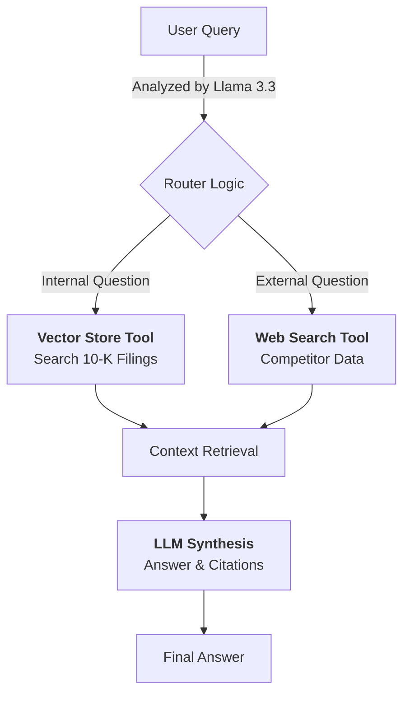
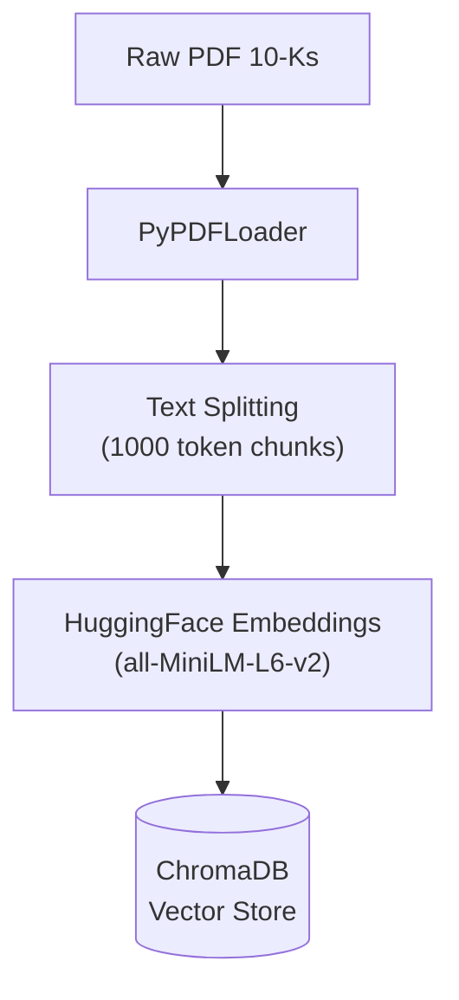

# Agentic Financial Analyst (SEC 10-K)

An autonomous AI agent designed to audit public company Annual Reports (SEC 10-K filings), extract critical risk factors, and benchmark financial performance against current web data.

---

## 🏗 System Architecture

The agent uses dynamic routing to decide whether a question should be answered from indexed filings or supplemented with external web search.


```mermaid
graph TD
    A[User Query] -->|Analyzed by Llama 3.3| B{Router Logic}
    B -->|Internal Question| C[<b>Vector Store Tool</b><br/>Search 10-K Filings]
    B -->|External Question| D[<b>Web Search Tool</b><br/>Competitor Data]
    C --> E[Context Retrieval]
    D --> E
    E --> F[<b>LLM Synthesis</b><br/>Answer & Citations]
    F --> G[Final Answer]
```

## The "Twin-Engine" Approach

**Internal Engine (RAG):** Used for questions such as "What are the primary supply chain risks?" or "Summarize the revenue recognition policy." It retrieves relevant filing context with page references.

**External Engine (Web):** Used for questions such as "How does Tesla's growth compare to BYD in 2024?" when the required information is not contained in the indexed filing.

## ⚙️ Data Ingestion Pipeline


```mermaid
graph TD
    A[Raw PDF 10-Ks] --> B[PyPDFLoader]
    B --> C["Text Splitting<br/>(1000 token chunks)"]
    C --> D["HuggingFace Embeddings<br/>(all-MiniLM-L6-v2)"]
    D --> E[("ChromaDB<br/>Vector Store")]
```

## Technical Components

* **Loader:** PyPDFLoader for filing text extraction.
* **Chunking:** RecursiveCharacterTextSplitter for long-form document segmentation.
* **Embeddings:** Local HuggingFace embeddings (`all-MiniLM-L6-v2`).
* **Vector Store:** ChromaDB for persisted local retrieval.
* **Routing:** Llama 3.3 chooses between filing retrieval and web search.
* **Observability:** Execution logs capture tool usage, latency, and token estimates.

## 🚀 Setup & Usage

### Prerequisites

* Python 3.10+
* API keys for Groq and Tavily

### Installation

```bash
git clone https://github.com/MeghnaB12/agentic-financial-analyst.git
cd agentic-financial-analyst
python3 -m venv venv
source venv/bin/activate  # Windows: venv\Scripts\activate
pip install -r requirements.txt
```

Create a `.env` file:

```env
GROQ_API_KEY=gsk_...
TAVILY_API_KEY=tvly_...
```

### Run the project

Ingest the 10-K PDFs in `/data`:

```bash
python src/ingest.py
```

Run the analyst:

```bash
python src/agent.py
```

The application emits a tool/execution trace and writes observability output to `financial_analysis_logs.txt`.

## 🛠 Design Decisions

### 1. Pinned orchestration dependency

LangChain is pinned to a known working version to reduce breakage from upstream API changes and keep the project reproducible.

### 2. Few-shot response guidance

Few-shot examples guide the model toward a consistent financial-analysis response style and source-aware phrasing.

### 3. Failsafe observability

`DualLogger` records execution data, and token usage falls back to an estimate when provider metadata is unavailable. This keeps the evaluation log populated even when an API omits usage metadata.

## ✅ Verification & Evaluation

The `evaluate_project` harness runs predefined scenarios that exercise both major routing paths:

1. **Internal retrieval scenario:** asks about filing risk factors and checks that the agent uses the local 10-K retrieval path.
2. **Hybrid scenario:** asks for a comparative financial question that can require external search when the filing alone is insufficient.

For each run, the harness records:

* **Latency:** execution time in seconds.
* **Tool usage:** number of tool calls.
* **Token estimate:** prompt + completion usage when available, with a fallback estimate otherwise.

These metrics are operational signals rather than a claim of answer correctness; qualitative financial answers still require source review.

## 📊 Observability Logs

Logs provide an audit trail of tool selection and retrieved evidence without exposing private model reasoning.

Sample execution trace:

```text
> Entering new AgentExecutor chain...
Invoking: search_10k_documents with {'query': 'Item 1A. Risk Factors supply chain'}
[Source: Apple 10-K, Page 12] "The Company relies on single-source outsourcing partners..."

Invoking: tavily_search_results_json with {'query': 'Apple revenue growth vs Huawei 2024'}
[Source: Web] external comparison result returned to the agent
```

## 📂 Repository Structure

```text
├── data/                        # Public 10-K PDFs
├── src/
│   ├── agent.py                 # Llama 3.3 + tools + evaluation harness
│   └── ingest.py                # PDF → embeddings → ChromaDB
├── chroma_db/                   # Persisted vector store
├── requirements.txt             # Pinned dependencies
├── financial_analysis_logs.txt  # Execution/observability output
└── README.md
```
